# Supervisor Update - 2026-05-30

## 1. Purpose of this note

This update is meant to do four things in one place:

1. recap the full pipeline built so far
2. explain how the autoencoder method works
3. summarize the main results and comparisons
4. clarify how our clustering relates both to the HEAT paper and to the supervisor's recent comment about clustering anomalies

Important update since the previous meeting:

- the supervisor confirmed that `Power Interval Trend Log` should be treated as `kW` for all sheets
- therefore the remaining flow-magnitude mismatch should now be interpreted as a subsystem / formula / comparability issue, not mainly as a unit-selection issue

## 2. End-to-end recap

The current project pipeline is:

1. extract district-heating time series from the selected `cons_*` sheets
2. build three-channel daily windows:
   - supply temperature
   - return temperature
   - derived flow
3. train a convolutional autoencoder to reconstruct normal daily behavior
4. score each 24-hour window by reconstruction error
5. flag anomalous windows using the training `99th percentile`
6. interpret anomalies in three ways:
   - compare against a low delta-T engineering baseline
   - inspect the three signals directly in the top flagged windows
   - use clustering either on all windows or only on the detected anomaly windows

The main consumer sheets used so far are:

- `cons_abat_oliba`
- `cons_hostatgeria_underfloor_hea`
- `cons_hostatgeria_DHW_radiators`
- `cons_nostra_senyora`

## 3. How the data is prepared

The preprocessing is implemented mainly in:

- [prepare_autoencoder_windows.py](</D:/Downloads/KTH/Masters Thesis/thesis-heat-detection/Codes/scripts/prepare_autoencoder_windows.py>)
- [features.py](</D:/Downloads/KTH/Masters Thesis/thesis-heat-detection/Codes/src/features.py>)

The main preprocessing steps are:

1. read one Excel sheet
2. parse timestamps and sort chronologically
3. compute `delta_t_c = supply - return`
4. derive a flow feature from:

```text
m = Power / (Cp * (Ts - Tr))
```

with:

```text
Cp = 4180 J/(kg C)
```

with the current working assumption confirmed by the supervisor:

```text
Power Interval Trend Log is in kW for all sheets
```

5. mark active-heating rows using:
   - `power > 0`
   - `delta_t > 0`
   - finite positive flow feature
6. set non-active rows to `NaN`
7. resample to `15-minute` intervals
8. interpolate only short gaps
9. build `24-hour` windows with `12-hour` stride
10. keep only windows with:
    - at least `60%` active-heating share
    - at least `85%` complete-data share
11. standardize each channel before training

At `15-minute` resolution, each window has:

```text
96 time steps x 3 channels
```

## 4. How the autoencoder works

The model is defined in:

- [autoencoder.py](</D:/Downloads/KTH/Masters Thesis/thesis-heat-detection/Codes/src/autoencoder.py>)

The current architecture is a small 1D convolutional autoencoder:

1. encoder:
   - `Conv1d`
   - `ReLU`
   - `MaxPool`
   - `Conv1d`
   - `ReLU`
   - `MaxPool`
2. decoder:
   - `ConvTranspose1d`
   - `ReLU`
   - `ConvTranspose1d`

Conceptually:

```text
input window -> encoder -> latent representation -> decoder -> reconstructed window
```

The encoder compresses the daily thermal-hydraulic pattern into a smaller internal representation.  
The decoder expands that representation back into a reconstructed 24-hour window.

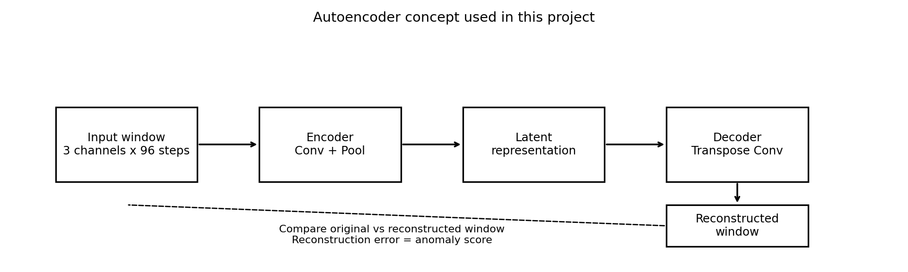

Interpretation:

- the input is one standardized 24-hour multivariate window
- the encoder compresses it
- the decoder reconstructs it
- the difference between original and reconstructed window becomes the anomaly score

## 5. How training works

Training is implemented in:

- [train_autoencoder.py](</D:/Downloads/KTH/Masters Thesis/thesis-heat-detection/Codes/scripts/train_autoencoder.py>)

Training logic:

1. first `80%` of windows are used as the training set
2. the model learns by minimizing reconstruction mean squared error
3. after training, the model reconstructs all windows
4. one total reconstruction error is computed for each window
5. the anomaly threshold is set to the training `99th percentile`

So the anomaly rule is:

```text
flag window if reconstruction_error > train_p99_threshold
```

This is a reconstruction-based anomaly detector:

- if the model has learned that daily pattern well, error stays low
- if the daily pattern is unusual, error becomes high

Representative training-loss figure:

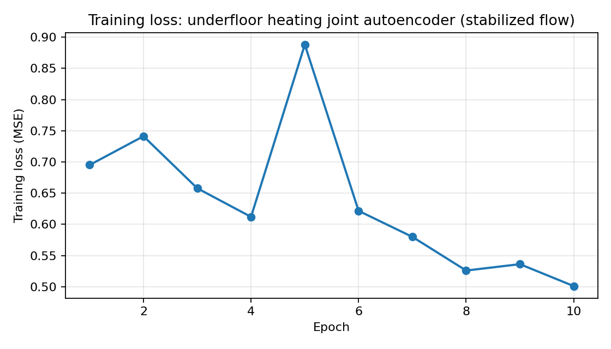

Representative reconstruction-error figure:

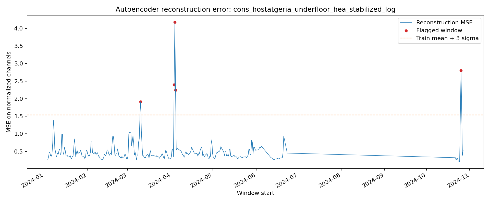

Gap-aware reconstruction-error figure:

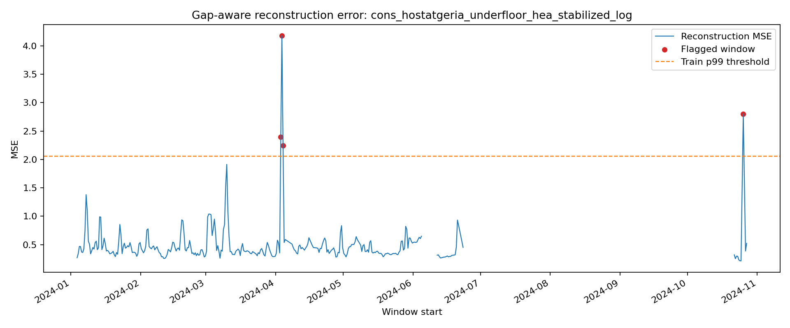

Error-distribution figure:

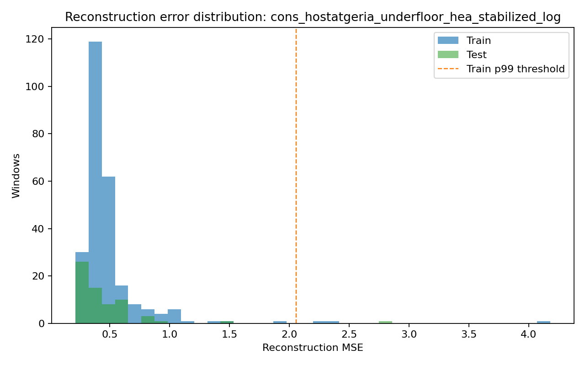

Interpretation:

- the training-loss plot shows the model learning to reconstruct the training windows better across epochs
- the reconstruction-error plot shows the final anomaly scores per daily window
- the horizontal threshold line marks the training `99th percentile`
- flagged windows are the windows above that threshold
- the gap-aware plot is important because it shows seasonal gaps in retained windows explicitly instead of drawing a misleading continuous line
- the distribution plot shows the normal error band and how the flagged windows sit in the upper tail

## 6. Joint detection vs per-feature attribution

The main model is still **joint**:

- supply temperature
- return temperature
- flow feature

are reconstructed together.

So the primary anomaly score is based on the full multivariate window.

However, after reconstruction, the error is also split by channel. That means for each flagged window we now also know:

- supply-channel reconstruction MSE
- return-channel reconstruction MSE
- flow-channel reconstruction MSE
- dominant anomalous feature

So the current method is:

```text
joint anomaly detection + per-feature attribution
```

not:

```text
three fully independent anomaly detectors only
```

Direct comparison figure:

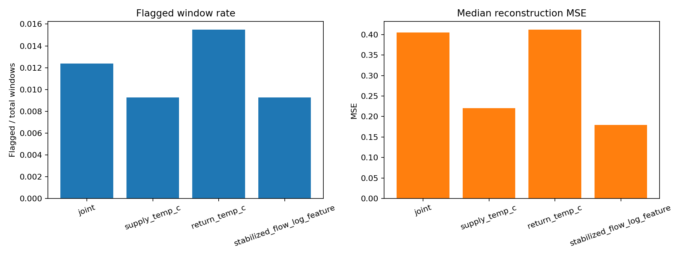

Interpretation:

- the joint model uses all three channels together
- the univariate models use only one feature each
- this figure helps show whether the anomaly signal is visible in one feature alone or mainly in the interaction between features

## 7. First engineering baseline: low delta-T

Before relying fully on the autoencoder, a simple engineering baseline was added:

- [run_dhc_delta_t_baseline.py](</D:/Downloads/KTH/Masters Thesis/thesis-heat-detection/Codes/scripts/run_dhc_delta_t_baseline.py>)

This baseline:

1. keeps active-heating rows
2. computes robust modified z-scores on `delta-T`
3. flags unusually low `delta-T`

This gives a physically interpretable reference.

Representative baseline figure:

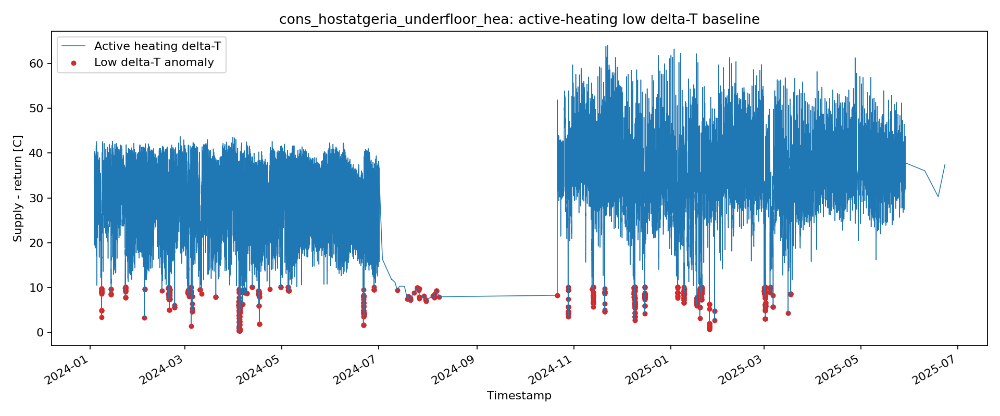

Interpretation:

- this is the simple engineering baseline
- it flags unusually low `delta-T` periods
- overlap between this baseline and the autoencoder strengthens confidence that the model is seeing meaningful thermal behavior

## 8. Why the stabilized flow lens was added

The raw flow feature is:

```text
flow = Power / (Cp * delta_T)
```

If `delta_T` becomes very small, raw flow can explode numerically.

That was especially visible in `cons_abat_oliba`.

So a second flow lens was added:

- floor `delta_T`
- clip extreme flow values
- apply `log1p`

This gives the `stabilized_log` flow feature.

The purpose is not to replace the physical idea, but to reduce arithmetic blow-up when `delta_T` is close to zero.

The raw-vs-stabilized difference is best seen in Abat Oliba:


Interpretation:

- the raw-flow version can be dominated by huge values caused by very small `delta_T`
- the stabilized-flow version keeps the same abnormal window visible, but makes the third channel much more interpretable

## 9. Main anomaly results

The strongest current case is:

```text
cons_hostatgeria_underfloor_hea
```

The key inspection summary is:

- [inspect_autoencoder_cons_hostatgeria_underfloor_hea_summary.csv](</D:/Downloads/KTH/Masters Thesis/thesis-heat-detection/Results/tables/inspect_autoencoder_cons_hostatgeria_underfloor_hea_summary.csv>)

The best single anomaly figure is:

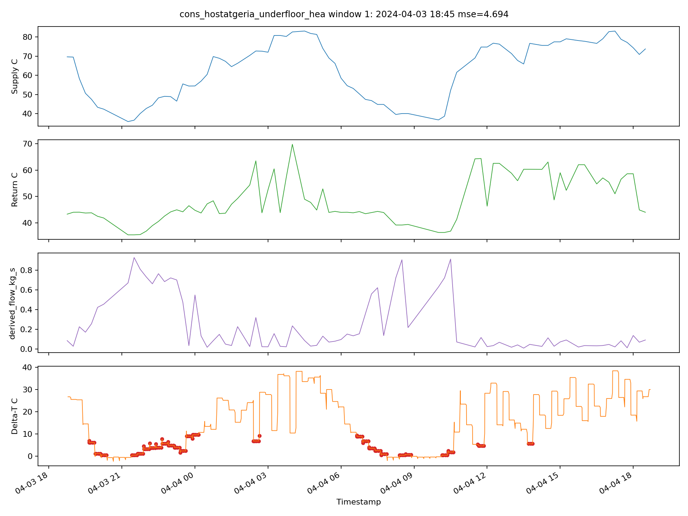

Interpretation:

- this shows one flagged 24-hour window
- top panel: supply temperature
- second panel: return temperature
- third panel: flow feature
- bottom panel: delta-T

Important finding:

- several top underfloor-heating anomalies overlap the low delta-T baseline
- one important window around October 2024 does **not** overlap low delta-T

That suggests the autoencoder is not only rediscovering the simple baseline.

## 9.1 Evaluation workflow used at the current stage

Because labeled fault data is not yet available, the current evaluation is based on structured anomaly review rather than formal classification metrics.

The current review workflow is:

1. rank windows by reconstruction error
2. inspect the strongest anomaly windows
3. compare them with the low delta-T baseline
4. look at dominant anomalous feature and per-feature reconstruction errors
5. compare anomaly families across sheets

Current review table:

- [anomaly_candidate_review_stabilized_log.csv](</D:/Downloads/KTH/Masters Thesis/thesis-heat-detection/Results/tables/anomaly_candidate_review_stabilized_log.csv>)

This table gives a more systematic basis for discussion with the supervisor than using only one or two example windows.

## 10. Abat Oliba: raw flow vs stabilized flow

The same raw-vs-stabilized comparison above is the best visual example of why stabilized flow was added.

An additional reconstruction-error distribution view for Abat Oliba is useful when discussing this:

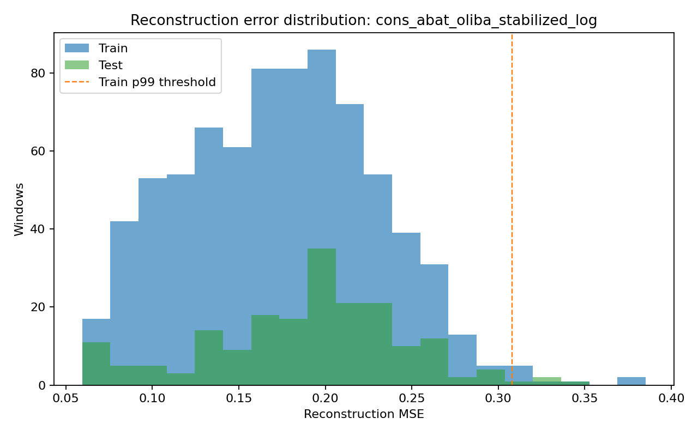

Interpretation:

- the Abat Oliba anomaly scores remain in a fairly compact range
- the stabilized lens makes the anomaly tail more interpretable without relying on unrealistically huge raw-flow magnitudes

## 11. Joint model vs per-feature autoencoders

To make anomaly interpretation stronger, we added separate univariate autoencoders for:

- `supply_temp_c`
- `return_temp_c`
- flow feature

Comparison figures:


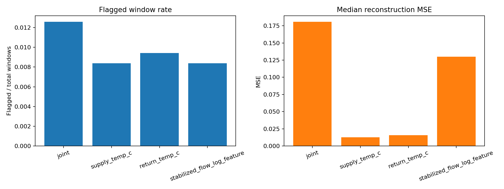

Main interpretation:

- for `cons_hostatgeria_underfloor_hea`, a large part of the anomaly signal is visible in the temperature channels, especially supply temperature
- for `cons_abat_oliba`, the overlap between the joint anomalies and single-feature anomalies is weak

Working conclusion:

- per-feature autoencoders are useful for explanation
- the joint autoencoder still matters, because some anomalies only stand out when the variables are considered together

## 12. Power / flow sanity check

We tested whether the supervisor-confirmed `kW` interpretation for `Power Interval Trend Log` gives reasonable flow magnitudes across all heating-consumer sheets.

Current comparison output:

- [power_scaling_all_heating_sheets.csv](</D:/Downloads/KTH/Masters Thesis/thesis-heat-detection/Results/tables/power_scaling_all_heating_sheets.csv>)

Current conclusion:

- the power unit assumption is now fixed by supervisor guidance: use `kW` for all sheets
- however, even under that fixed assumption, the implied flow magnitudes are not consistent across all subsystems

So the correct conclusion is now:

```text
we assume kW for all sheets, as confirmed by the supervisor, but the derived-flow interpretation is still not consistently validated across all heating-consumer sheets
```

This means the remaining mismatch should be attributed more to:

- subsystem differences
- formula applicability
- sensor / boundary comparability
- operating-state effects

than to uncertain unit choice

## 13. Clustering results: operating-regime clustering

The first clustering path we implemented was:

```text
cluster all daily windows
```

Purpose:

- identify operating regimes
- see whether anomalies fall inside or outside dominant normal regimes

The main figure is:

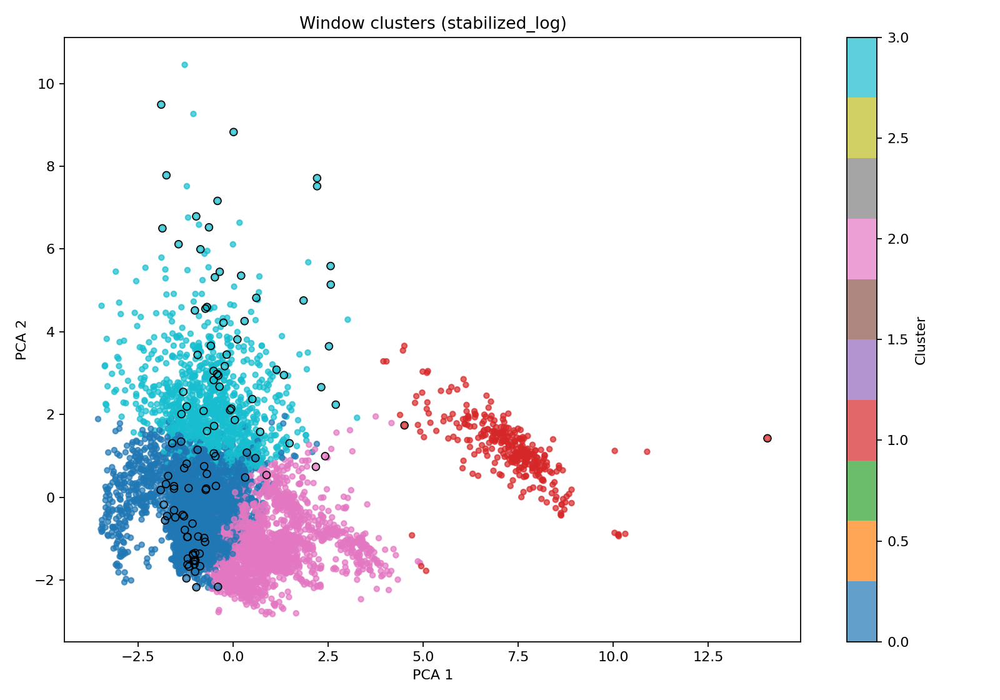

Interpretation:

- each point = one 24-hour window
- color = cluster
- outlined points = autoencoder anomalies
- axes are PCA projection axes for visualization only

This clustering showed that:

- underfloor heating mostly occupies one dominant cluster
- its strongest anomalies fall outside that dominant regime

That makes clustering useful as a regime-interpretation tool.

## 14. Feature clustering vs latent clustering

We compared:

1. feature-space clustering
2. latent-space clustering from the autoencoder

Representative figures:

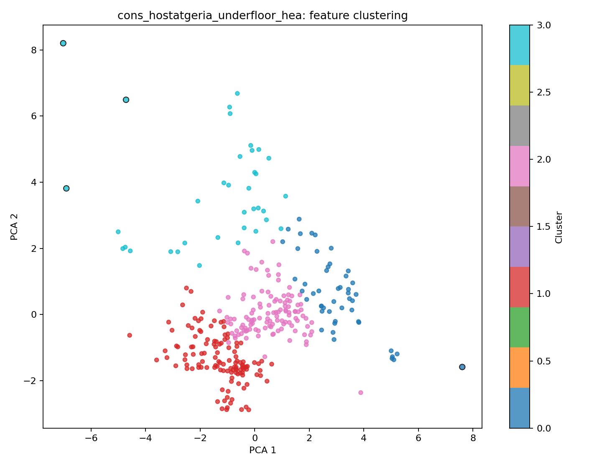

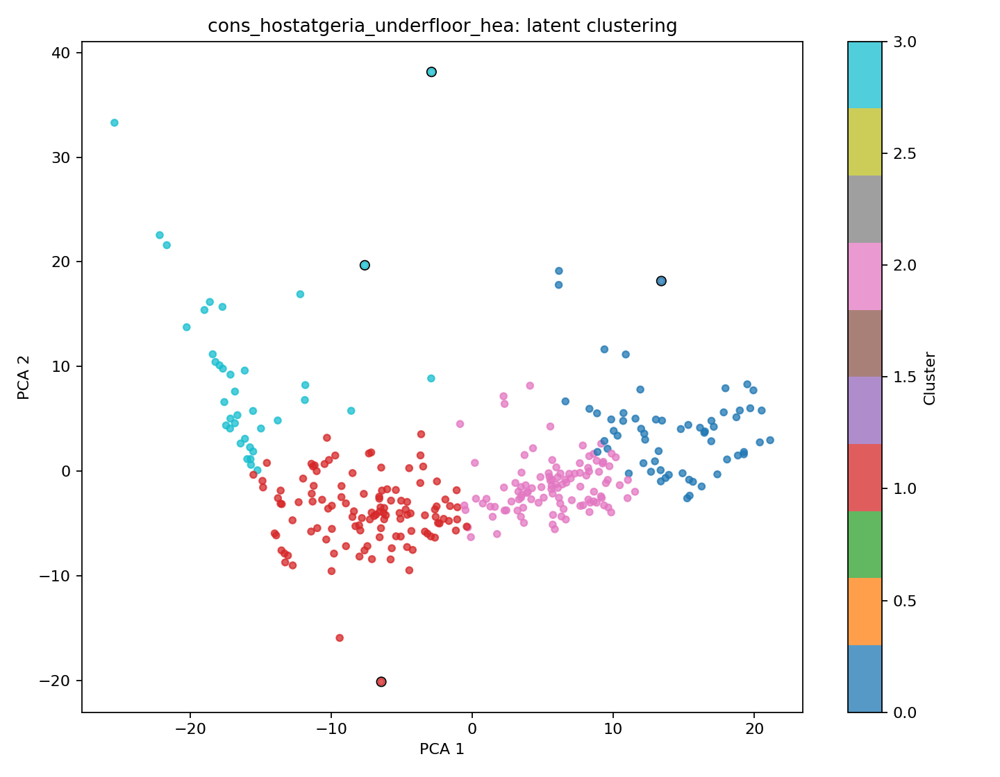

Current result:

- feature-space clustering is clearer and more useful operationally
- latent clustering is technically interesting, but currently weaker for interpretation

## 15. New clustering path: cluster only the detected anomalies

From the latest supervisor feedback, a second clustering interpretation was added:

```text
detect anomalies first -> cluster only the anomaly windows
```

This is implemented in:

- [cluster_detected_anomalies.py](</D:/Downloads/KTH/Masters Thesis/thesis-heat-detection/Codes/scripts/cluster_detected_anomalies.py>)

Main figure:

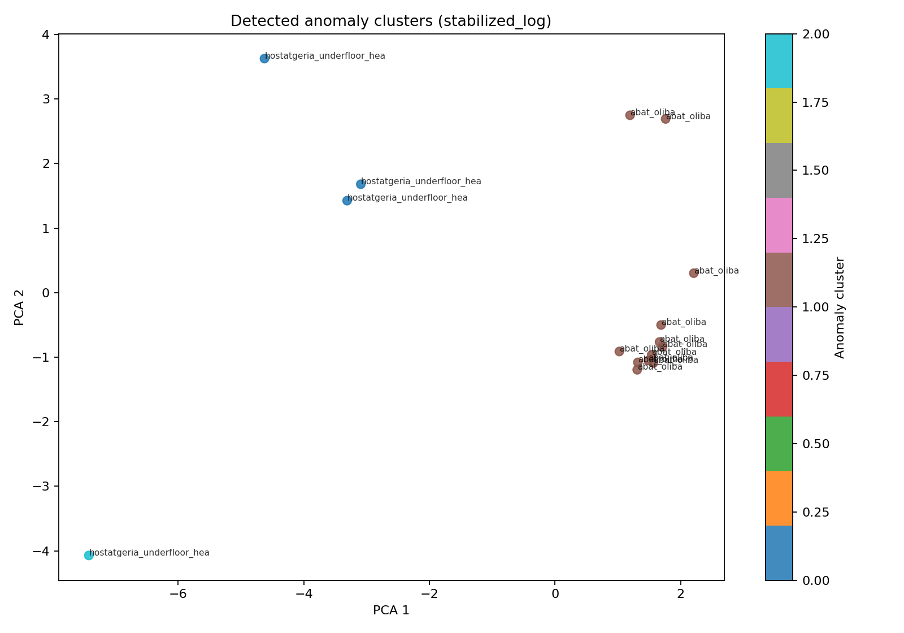

Direct feature-interpretation figures:


Current result:

- one anomaly cluster is mainly `cons_abat_oliba` and mostly return-temperature-driven
- one anomaly cluster is mainly underfloor-heating and supply-temperature-driven
- one small separate cluster contains the distinctive underfloor-heating return-temperature anomaly

This gives a useful interpretation:

```text
the anomalies are not one mixed set; they already separate into recurring anomaly families
```

Important clarification:

- the PCA scatter is only a similarity visualization
- `PCA 1` and `PCA 2` do not mean supply / return / flow directly
- the two new feature plots above are the direct answer to:
  - which anomaly clusters are mainly supply-driven?
  - which are mainly return-driven?
  - whether any are mainly flow-driven?

The strongest current anomaly-cluster interpretation is:

- cluster `0`: mainly underfloor-heating supply-temperature anomalies
- cluster `1`: mainly Abat Oliba return-temperature anomalies
- cluster `2`: one distinctive underfloor-heating return-temperature anomaly

## 16. How this compares with the HEAT paper

The HEAT paper still remains the reference guide, but the role of clustering differs.

### HEAT paper logic

The paper uses clustering to:

1. cluster substations / peer groups first
2. approximate relative topology
3. then perform fault detection within those peer groups

So the paper is closer to:

```text
cluster first -> detect faults within clusters
```

### Our current anomaly clustering

The new anomaly-clustering path is:

```text
detect anomalies first -> cluster only the anomaly windows
```

### Similarities

- both use unsupervised structure
- both use encoder-assisted representations or autoencoder logic
- both use clustering to avoid treating everything as one global population

### Differences

- HEAT clusters substations / peers before fault scoring
- we currently cluster anomaly windows after detection
- HEAT uses clustering for topology / peer-group creation
- we use clustering for anomaly-type grouping

Working interpretation:

The new anomaly clustering is a useful extension and probably closer to the supervisor's recent verbal request, but it is **not** the same as the original HEAT clustering role.

## 17. Best current conclusions

1. The reconstruction-based anomaly pipeline works end to end.
2. `cons_hostatgeria_underfloor_hea` remains the strongest case study.
3. `cons_abat_oliba` remains useful, especially with stabilized flow.
4. The per-feature anomaly interpretation is now much stronger than before.
5. The power column is now assumed to be `kW` for all sheets, based on supervisor guidance.
6. Even under that fixed `kW` assumption, the derived-flow interpretation is not consistently validated across all heating-consumer sheets.
7. Feature-space clustering of all windows is useful for operating-regime interpretation.
8. Clustering only the detected anomalies is useful for grouping anomaly families.
9. The anomaly-only clustering is likely closer to the supervisor's recent request.
10. The HEAT paper should still be used as the methodological reference, but our current anomaly-clustering step should be presented as an adaptation, not a direct reproduction of HEAT.

## 18. Recommended next step

The next important clarification with the supervisor is:

```text
Should clustering be used mainly in the HEAT sense (peer-group creation before fault detection),
or mainly in the anomaly-grouping sense (cluster the detected anomaly windows into anomaly types)?
```

If the answer is “both”, then the thesis can present:

1. HEAT-inspired peer-group clustering as the paper-aligned method
2. anomaly-only clustering as a practical adaptation for the smaller dataset
