# Supervisor Update - 2026-06-07

## 1. Purpose of this note

This update reflects three concrete changes after the last meeting:

1. the anomaly threshold has been changed from training `p99` to a `3-sigma` rule
2. the results now cover all seven heating-consumer sheets modeled end to end
3. the anomaly interpretation is now presented mainly through **dominant feature** views rather than PCA projections

The main detailed review tables are:

- [supervisor_results_sheet_2026-06-07.csv](</D:/Downloads/KTH/Masters Thesis/thesis-heat-detection/Results/tables/supervisor_results_sheet_2026-06-07.csv>)
- [supervisor_anomaly_review_2026-06-07.csv](</D:/Downloads/KTH/Masters Thesis/thesis-heat-detection/Results/tables/supervisor_anomaly_review_2026-06-07.csv>)

## 2. Current dataset scope

The seven heating-consumer sheets now modeled end to end are:

- `cons_abat_cisneros`
- `cons_abat_garriga`
- `cons_abat_marcet`
- `cons_abat_oliba`
- `cons_hostatgeria_DHW_radiators`
- `cons_hostatgeria_underfloor_hea`
- `cons_nostra_senyora`

The current model input remains:

- supply temperature
- return temperature
- stabilized derived flow

The engineering baseline remains:

- low `delta-T = supply - return` anomaly detection on active-heating rows

## 3. Threshold change

The old threshold was:

```text
flag window if reconstruction_error > training 99th percentile
```

The current threshold is now:

```text
flag window if reconstruction_error > mean(training_error) + 3 * std(training_error)
```

This is the standard `3-sigma` rule.

Interpretation:

- the threshold is still learned from the historical training error distribution
- but it is now tied to the training mean and standard deviation instead of an empirical percentile cutoff
- it is easier to explain statistically than the earlier `p99` rule

All current seven-sheet results below use:

```text
threshold_method = train_3sigma
```

Direct threshold-method comparison table:

- [threshold_method_comparison_2026-06-07.csv](</D:/Downloads/KTH/Masters Thesis/thesis-heat-detection/Results/tables/threshold_method_comparison_2026-06-07.csv>)

Sheet-by-sheet comparison from the same reconstruction-error outputs:

| Sheet | `p99` threshold | `3-sigma` threshold | Flagged with `p99` | Flagged with `3-sigma` |
| --- | ---: | ---: | ---: | ---: |
| `cons_abat_cisneros` | `0.274` | `0.312` | `9` | `4` |
| `cons_abat_garriga` | `0.318` | `0.280` | `9` | `17` |
| `cons_abat_marcet` | `0.430` | `0.400` | `8` | `10` |
| `cons_abat_oliba` | `0.308` | `0.342` | `12` | `2` |
| `cons_hostatgeria_DHW_radiators` | `0.460` | `0.356` | `29` | `50` |
| `cons_hostatgeria_underfloor_hea` | `2.056` | `1.539` | `4` | `5` |
| `cons_nostra_senyora` | `0.452` | `0.366` | `9` | `18` |

Current reading:

1. `3-sigma` is **not** uniformly stricter or looser than `p99`
2. for `cons_abat_cisneros` and `cons_abat_oliba`, `3-sigma` is stricter and flags fewer windows
3. for `cons_abat_garriga`, `cons_hostatgeria_DHW_radiators`, and `cons_nostra_senyora`, `3-sigma` is looser and flags substantially more windows
4. this happens because `p99` depends only on the empirical top `1%` tail, while `3-sigma` depends on the mean and spread of the training-error distribution
5. the threshold choice therefore interacts with the shape and skewness of each sheet's training-error distribution

## 4. Raw flow vs stabilized flow

The main reported results in this note use **stabilized derived flow**.

The raw-flow version is still useful as an ablation because it shows why stabilization was added.

The issue with raw flow is:

```text
flow = Power / (Cp * delta-T)
```

When `delta-T` becomes very small, raw derived flow can become unrealistically large and dominate the anomaly score.

The clearest example is `cons_abat_oliba`.

Raw-flow top anomaly:

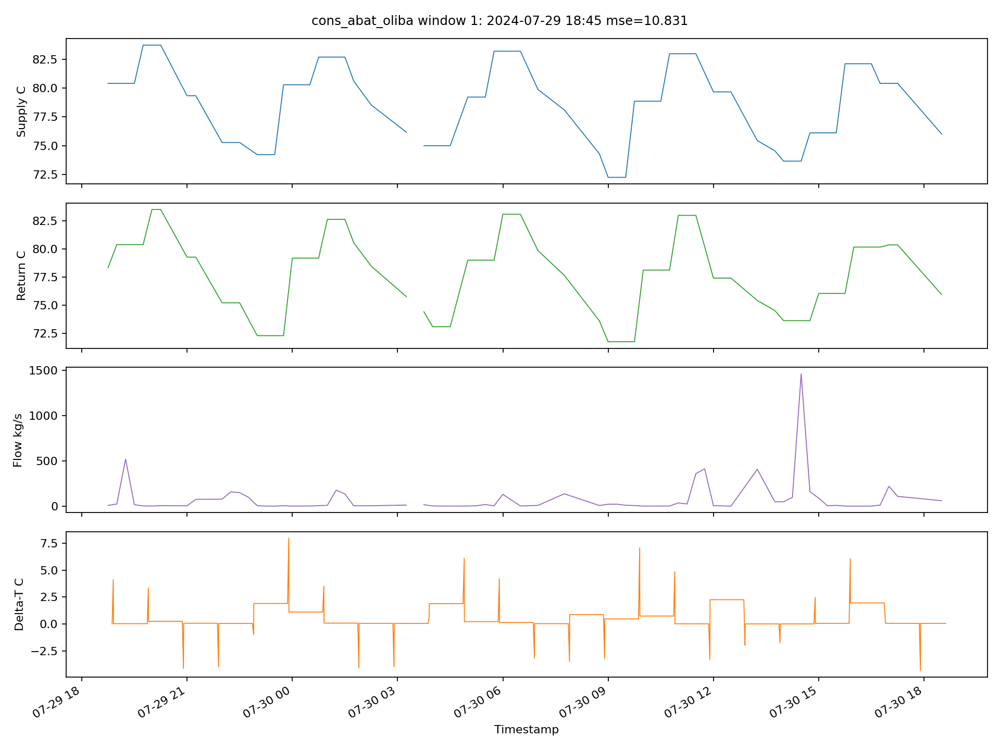

Stabilized-flow top anomaly:

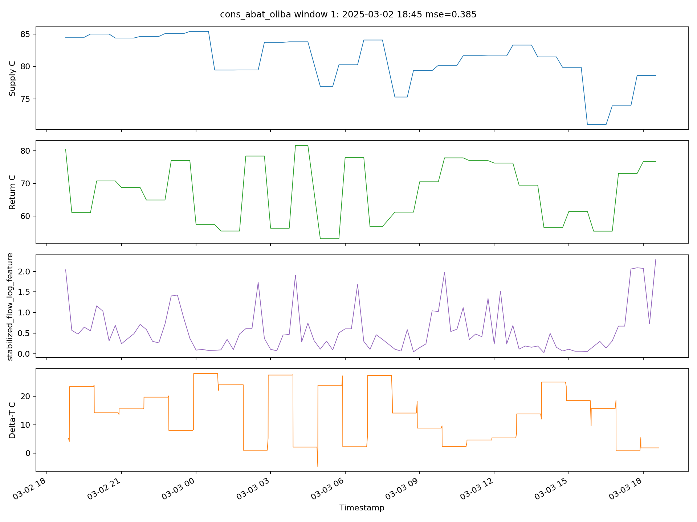

Current interpretation:

1. in the raw-flow version, the top Abat Oliba anomalies are mainly `derived_flow_kg_s` anomalies with very small median delta-T and very large implied flow values
2. in the stabilized-flow version, the top anomalies become much more interpretable and shift toward `return_temp_c` or `supply_temp_c`
3. for `cons_hostatgeria_underfloor_hea`, the anomaly behavior is comparatively stable under both lenses, which is useful robustness evidence

Reference comparison table:

- [autoencoder_lens_comparison.csv](</D:/Downloads/KTH/Masters Thesis/thesis-heat-detection/Results/tables/autoencoder_lens_comparison.csv>)

The practical decision is therefore:

```text
use stabilized flow as the main method
use raw flow only as a comparison to justify why stabilization is needed
```

## 5. Sheet-level result summary

Main sheet-level review table:

- [supervisor_results_sheet_2026-06-07.csv](</D:/Downloads/KTH/Masters Thesis/thesis-heat-detection/Results/tables/supervisor_results_sheet_2026-06-07.csv>)

Important fields in that table:

- `threshold_value`
- `flagged_windows`
- `flagged_rate`
- `top_reconstruction_mse`
- `top_dominant_anomalous_feature`
- `top_has_low_delta_t_overlap`
- `supply_dominant_count`
- `return_dominant_count`
- `flow_dominant_count`

Cross-building reconstruction-error comparison:

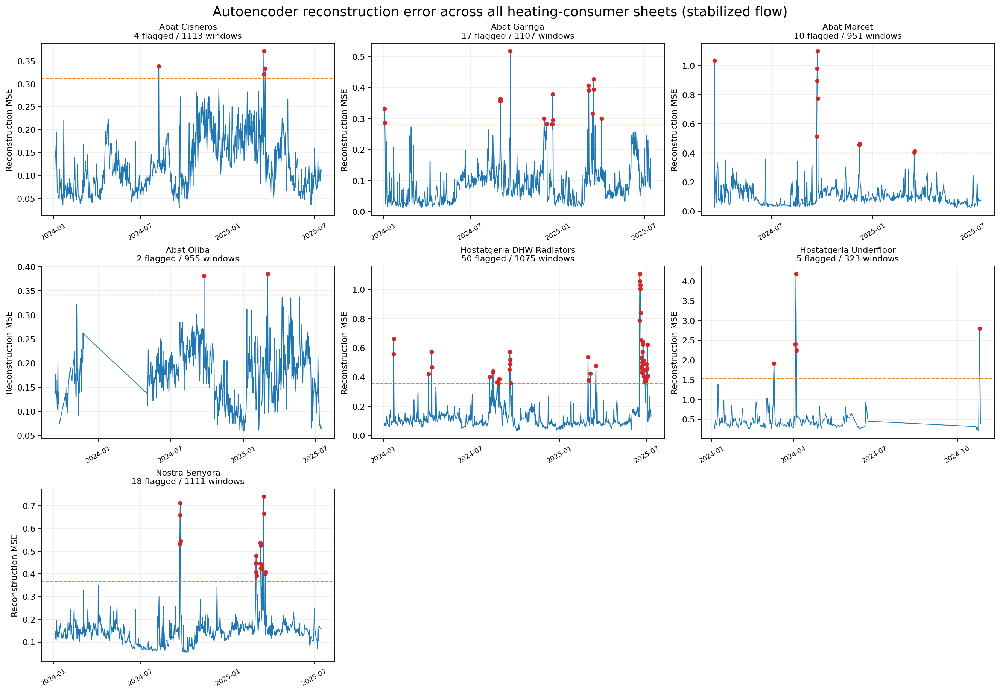

Cross-building anomaly-count comparison:

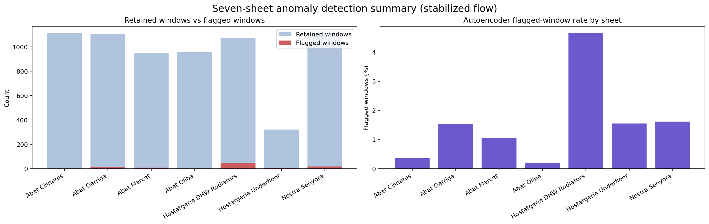

Cross-building baseline-vs-autoencoder comparison:

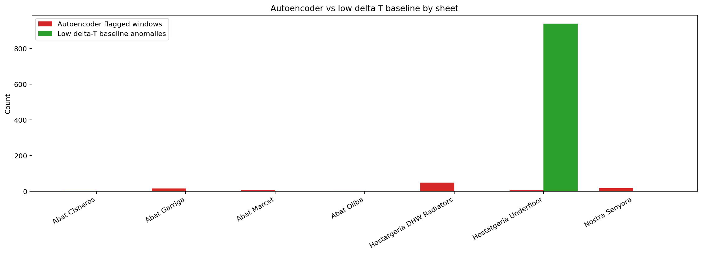

Top inspected anomaly window from each sheet:

`cons_abat_cisneros`

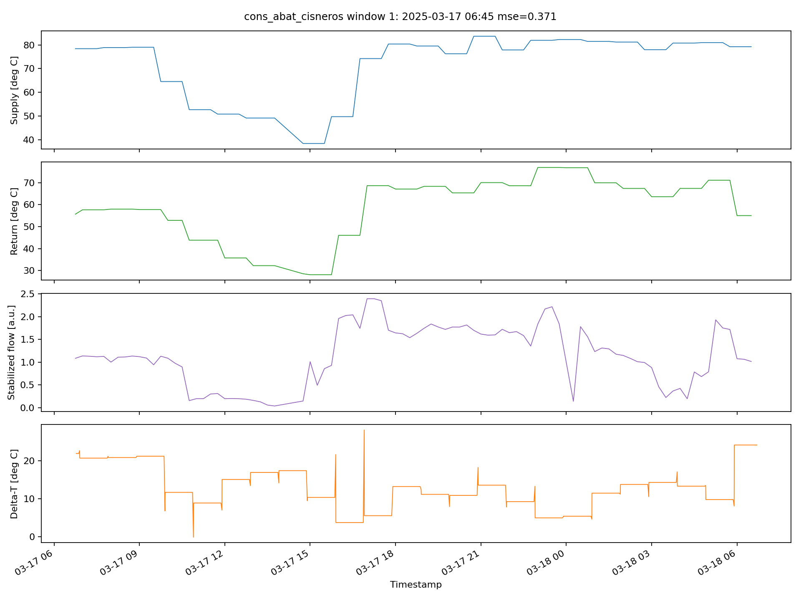

`cons_abat_garriga`

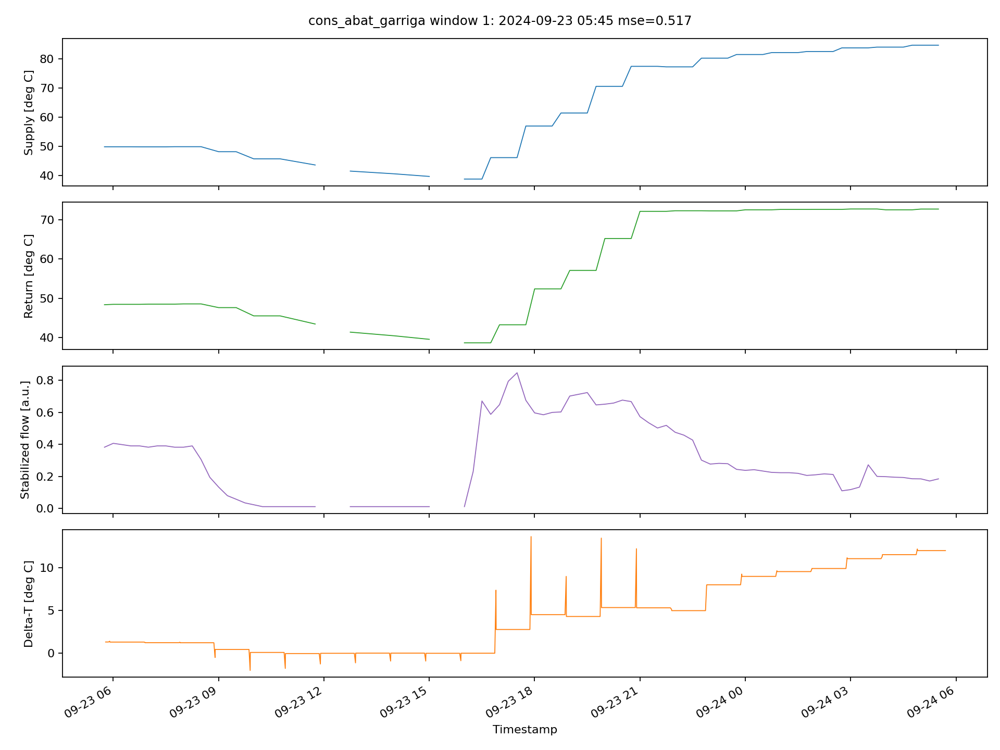

`cons_abat_marcet`

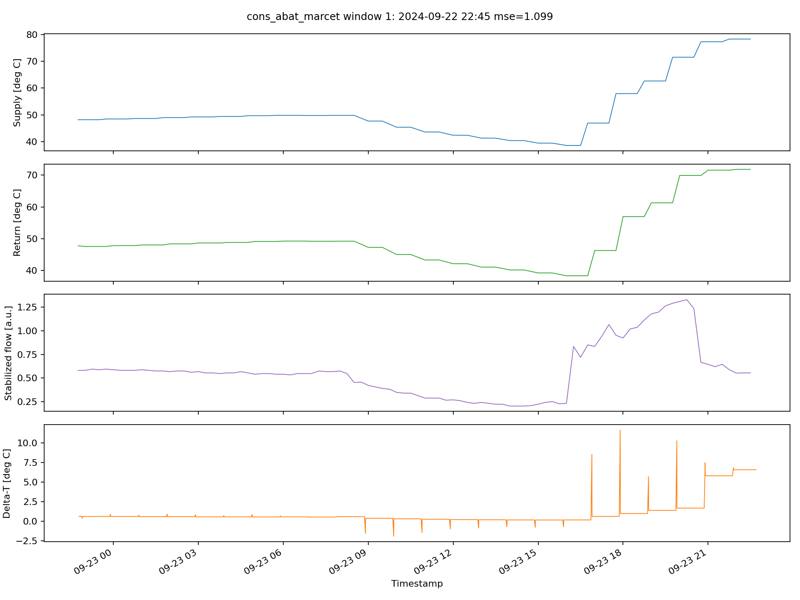

`cons_abat_oliba`


`cons_hostatgeria_DHW_radiators`

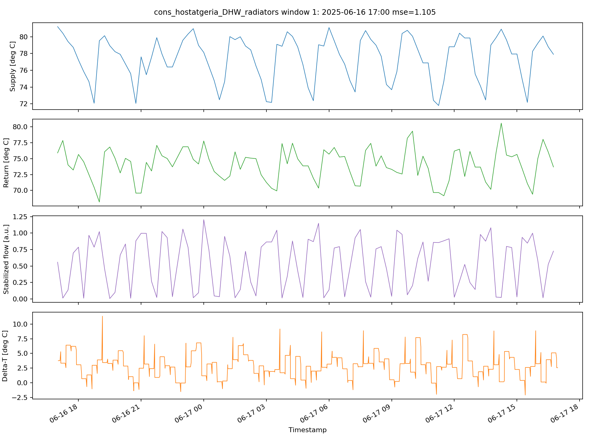

`cons_hostatgeria_underfloor_hea`

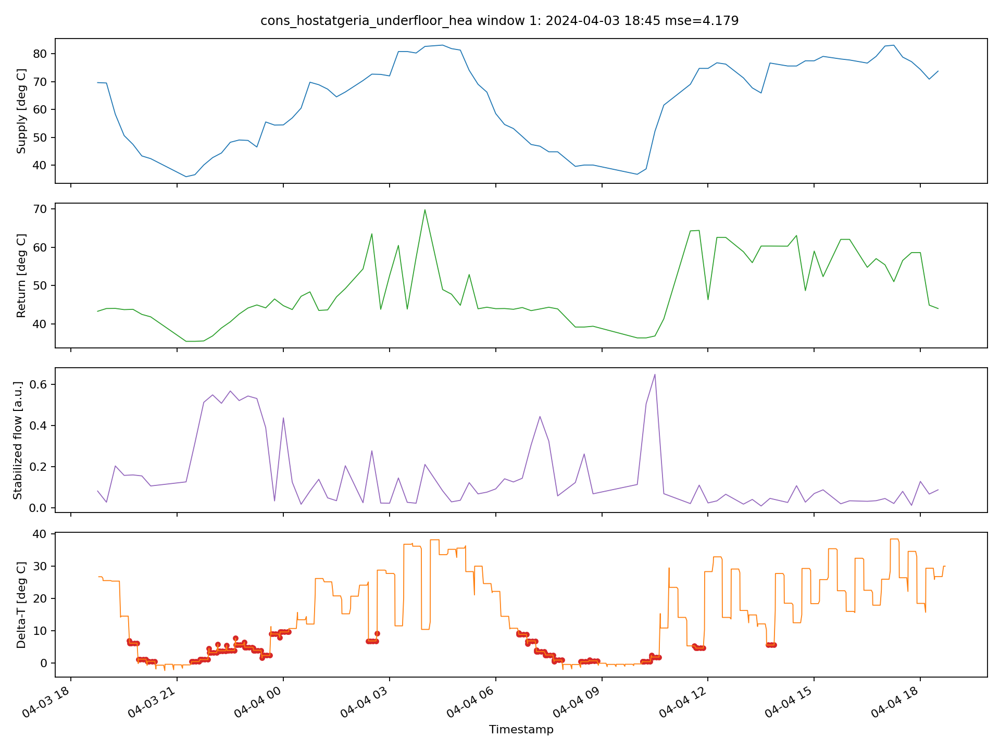

`cons_nostra_senyora`

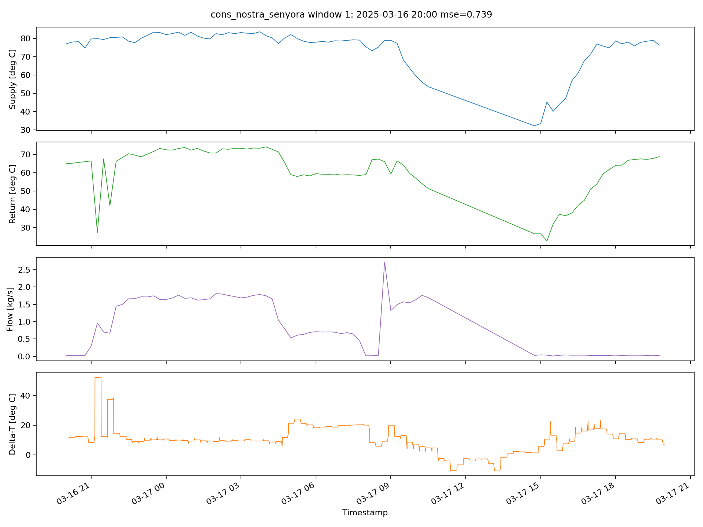

Current sheet-level reading:

1. `cons_hostatgeria_underfloor_hea`
   - still the strongest case
   - `5` flagged windows
   - top anomaly is `supply_temp_c` dominated
   - top anomaly overlaps the low delta-T baseline

2. `cons_hostatgeria_DHW_radiators`
   - highest flagged count: `50`
   - strongly flow-dominant
   - no top-window overlap with low delta-T baseline

3. `cons_abat_oliba`
   - only `2` flagged windows under 3-sigma
   - now much more selective than before
   - top anomaly is `return_temp_c` dominated

4. `cons_abat_garriga`
   - `17` flagged windows
   - mostly return-dominant anomalies

5. `cons_nostra_senyora`
   - `18` flagged windows
   - mixed, but mostly return-dominant with some supply and flow

6. `cons_abat_marcet`
   - `10` flagged windows
   - mostly flow-dominant

7. `cons_abat_cisneros`
   - `4` flagged windows
   - entirely flow-dominant in the current flagged set

## 6. Low delta-T baseline

The low delta-T baseline is still only a reference method, not an input to the autoencoder.

It is useful because it helps answer:

```text
Is the autoencoder finding anomalies that also look suspicious from a simple engineering perspective?
```

Current result:

- only `cons_hostatgeria_underfloor_hea` has clear top-anomaly overlap with the low delta-T baseline
- all other top reviewed anomalies do not overlap the strict low delta-T rule

This is one major reason underfloor heating remains the strongest thesis case.

## 7. Dominant feature interpretation

This is now the main anomaly-typing view.

Instead of asking PCA to separate anomaly types visually, we directly group anomalies by their dominant feature:

- `Supply`
- `Return`
- `Flow`

Main summary table:

- [anomaly_feature_type_summary_stabilized_log.csv](</D:/Downloads/KTH/Masters Thesis/thesis-heat-detection/Results/tables/anomaly_feature_type_summary_stabilized_log.csv>)

Per-sheet feature-type table:

- [anomaly_feature_type_sheet_summary_stabilized_log.csv](</D:/Downloads/KTH/Masters Thesis/thesis-heat-detection/Results/tables/anomaly_feature_type_sheet_summary_stabilized_log.csv>)

Feature-type count figure:

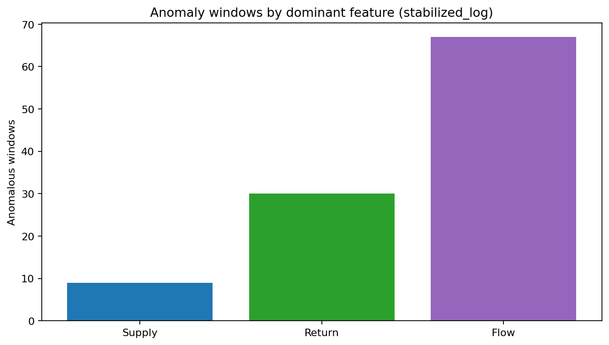

Median per-feature error inside each feature type:

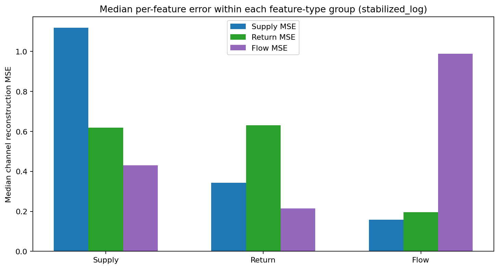

Feature type by sheet:

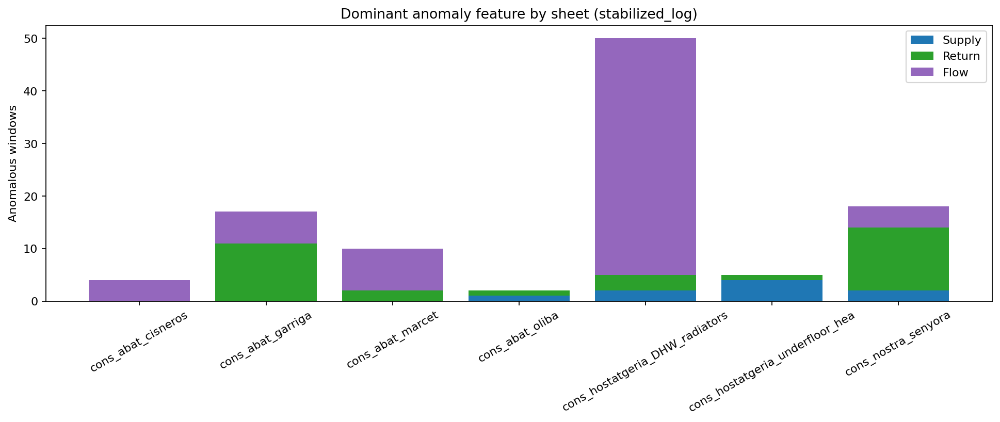

Direct anomaly-feature scatter using real per-feature errors and no PCA:

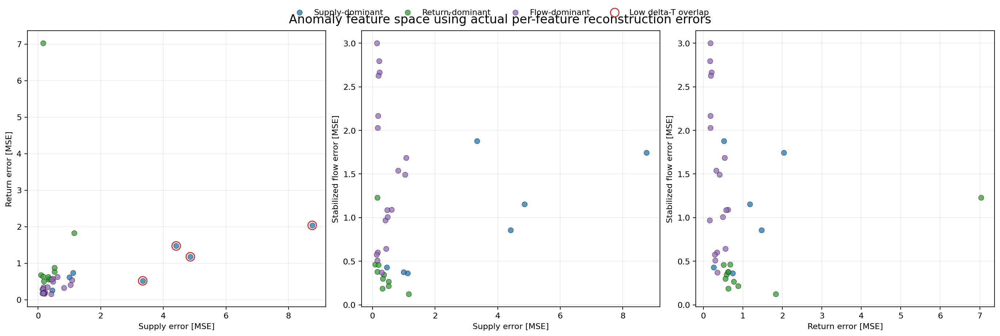

Current seven-sheet result:

- `Flow`-dominant anomalies: `67`
- `Return`-dominant anomalies: `30`
- `Supply`-dominant anomalies: `9`

This is the cleanest current answer to:

```text
what feature is the anomaly in?
```

Current interpretation:

- most anomalies are flow-dominant
- a smaller but still substantial set are return-dominant
- only a few are supply-dominant
- the new scatter uses actual per-feature reconstruction errors on the axes, so the feature-type separation is visible without PCA

## 8. Additional interpretation figures

These figures are not new methods. They are additional views on the same seven-sheet stabilized-flow result set, intended to make supervisor review easier.

### 8.1 Threshold distributions by sheet

This shows the training reconstruction-error distribution for each sheet, with both threshold rules overlaid.

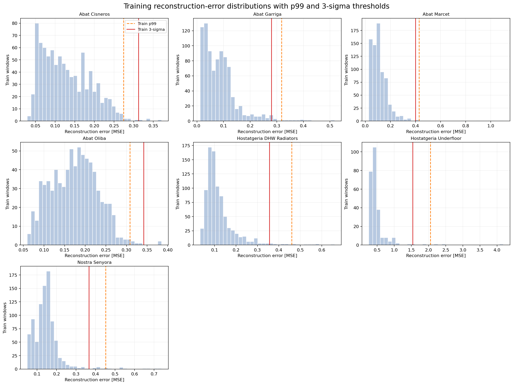

Use this to discuss:

- why `p99` and `3-sigma` differ by sheet
- whether the training-error tail looks heavy or skewed
- whether the current threshold looks too strict or too loose

### 8.2 Dominant anomaly feature over time

This shows when flagged windows occur and what their dominant feature is.

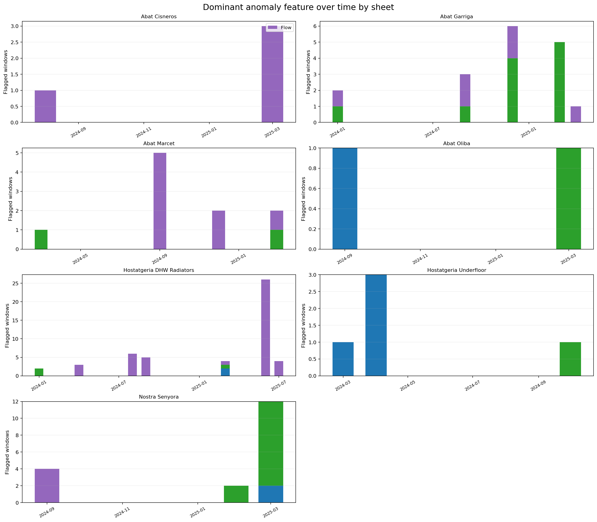

Use this to discuss:

- whether anomaly type changes by season
- whether some buildings have repeated periods of one anomaly type
- whether flow-dominant anomalies cluster in time

### 8.3 Top anomaly timeline by sheet

This shows the top reviewed anomaly windows as a timeline.

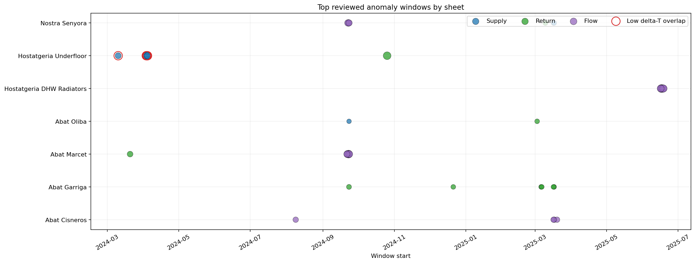

Encoding:

- color = dominant feature
- point size = reconstruction error
- red outline = low delta-T overlap

Use this to discuss:

- when the strongest reviewed anomalies occur
- whether anomalies are isolated or repeated
- whether low delta-T overlap is concentrated in one sheet or period

### 8.4 Per-sheet reviewed anomaly feature heatmaps

This gives a compact view of the top reviewed anomaly windows for each sheet.

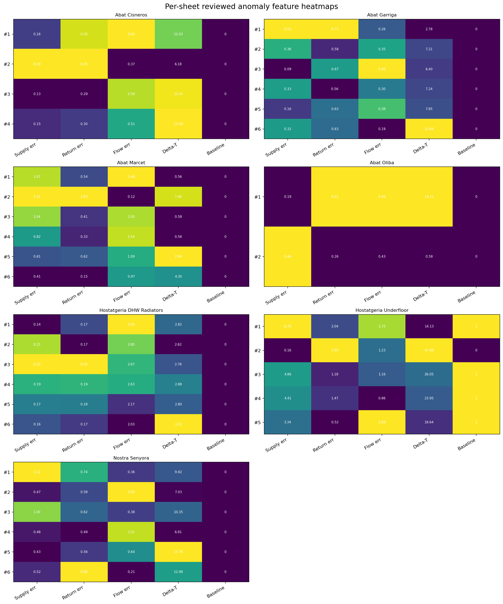

Columns:

- supply error
- return error
- flow error
- median delta-T
- low delta-T baseline overlap

Use this to discuss:

- which feature really dominates inside each reviewed anomaly
- whether high flow errors also come with very small delta-T
- which reviewed windows are most physically interesting

### 8.5 Raw vs stabilized flow flagged counts

This is the clearest compact justification for keeping stabilized flow as the main method.

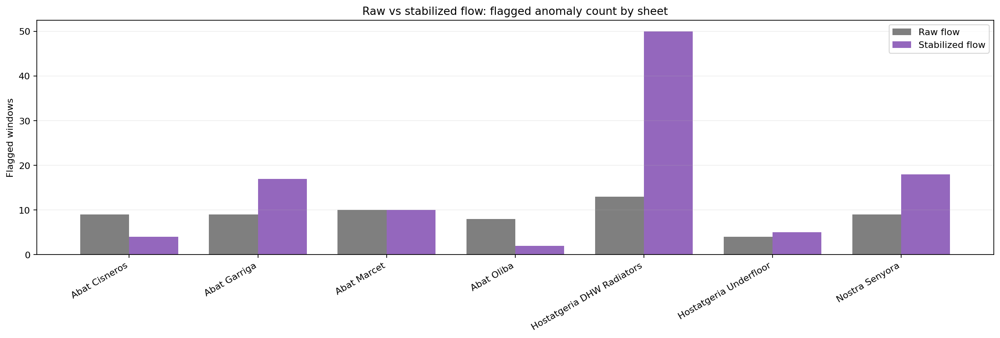

Use this to discuss:

- how much stabilization changes anomaly volume
- which sheets are most sensitive to raw-flow instability
- whether the stabilized lens is materially changing the result set

### 8.6 Train vs test anomaly split

This separates anomalies found in the chronological training portion from those found later in the held-out test portion.

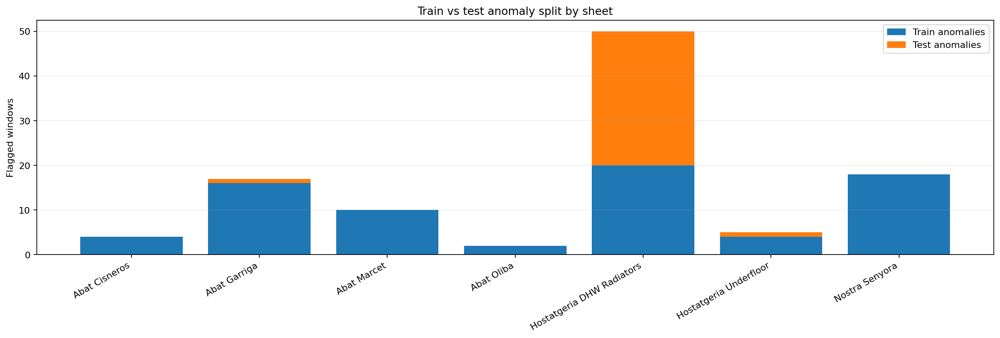

Use this to discuss:

- whether the anomalies are mostly historical tail behavior
- whether later periods also contain flagged windows
- whether some sheets are more test-heavy than others

### 8.7 Representative anomaly families

This gives one representative example for each main anomaly family.

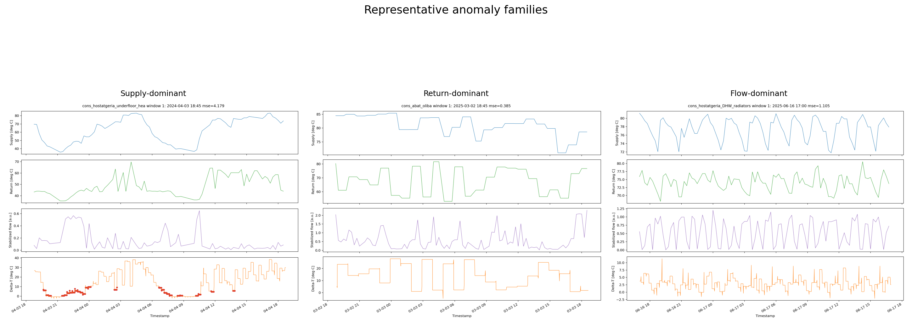

The current panel uses:

- supply-dominant: underfloor heating
- return-dominant: Abat Oliba
- flow-dominant: Hostatgeria DHW radiators

Use this to discuss:

- whether the family labels are physically convincing
- whether one family should become the main thesis narrative
- whether some family looks more like a feature artifact than a true operational anomaly

### 8.8 Low delta-T overlap summary

This summarizes how often the reviewed anomalies also overlap the engineering low delta-T baseline.

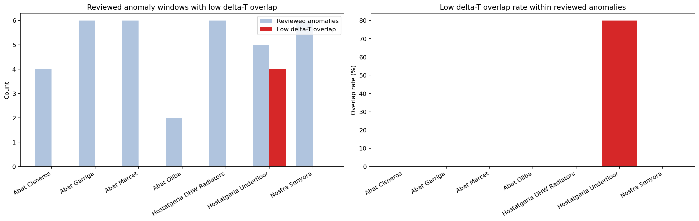

Use this to discuss:

- which sheets agree with the simple engineering rule
- which sheets show anomaly behavior beyond low delta-T
- why underfloor heating remains the strongest case

## 9. Operating-regime clustering

The all-window clustering is still useful for showing operating regimes, but it is not the main anomaly-type view.

Cross-building cluster distribution:

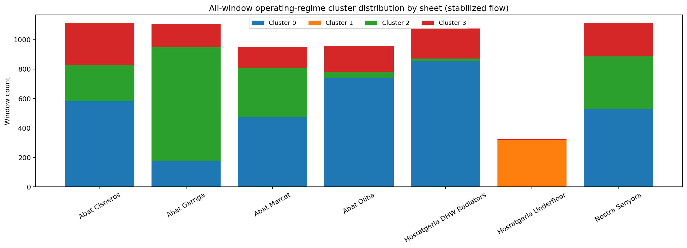

Main table:

- [cluster_summary_stabilized_log.csv](</D:/Downloads/KTH/Masters Thesis/thesis-heat-detection/Results/tables/cluster_summary_stabilized_log.csv>)

Current reading:

- cluster occupancy is highly uneven across sheets
- underfloor heating still occupies a very distinctive regime
- some clusters contain many more anomalies than others

But this is still regime interpretation, not direct supply / return / flow anomaly typing.

## 10. Anomaly-only clustering

The anomaly-only clustering is still available, but it should now be treated as a **secondary anomaly-family view**, not the main explanation layer.

Main tables:

- [anomaly_cluster_summary_stabilized_log.csv](</D:/Downloads/KTH/Masters Thesis/thesis-heat-detection/Results/tables/anomaly_cluster_summary_stabilized_log.csv>)
- [anomaly_cluster_sheet_summary_stabilized_log.csv](</D:/Downloads/KTH/Masters Thesis/thesis-heat-detection/Results/tables/anomaly_cluster_sheet_summary_stabilized_log.csv>)

Distribution by sheet:

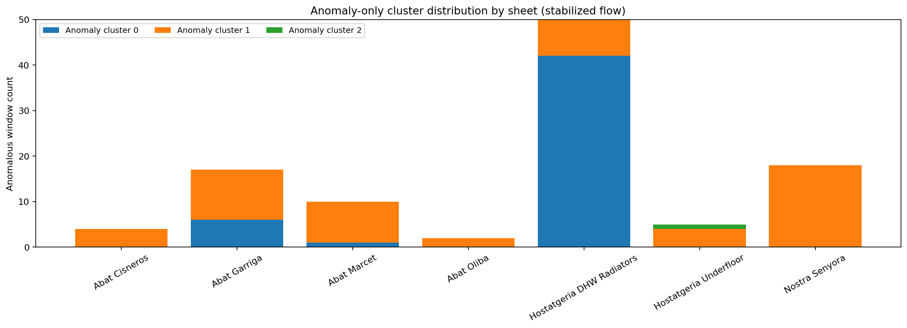

Feature composition:

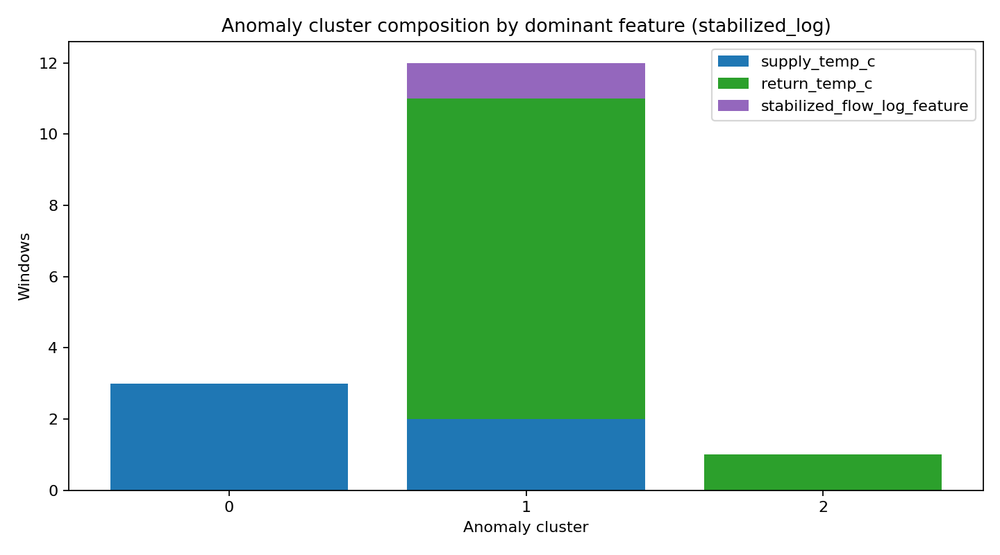

Median per-feature reconstruction error by cluster:

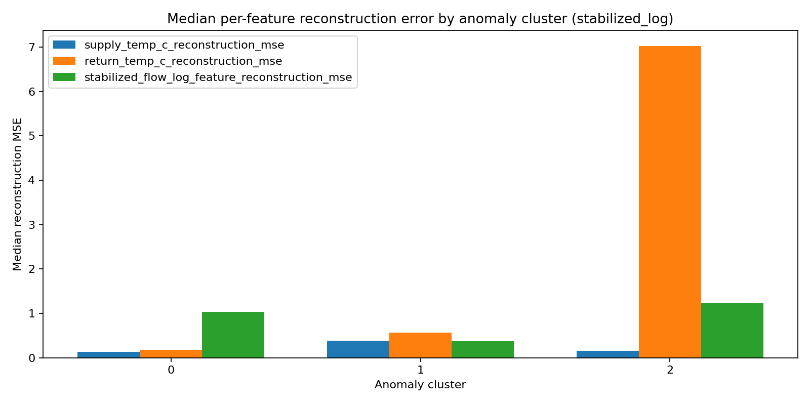

Heatmap:

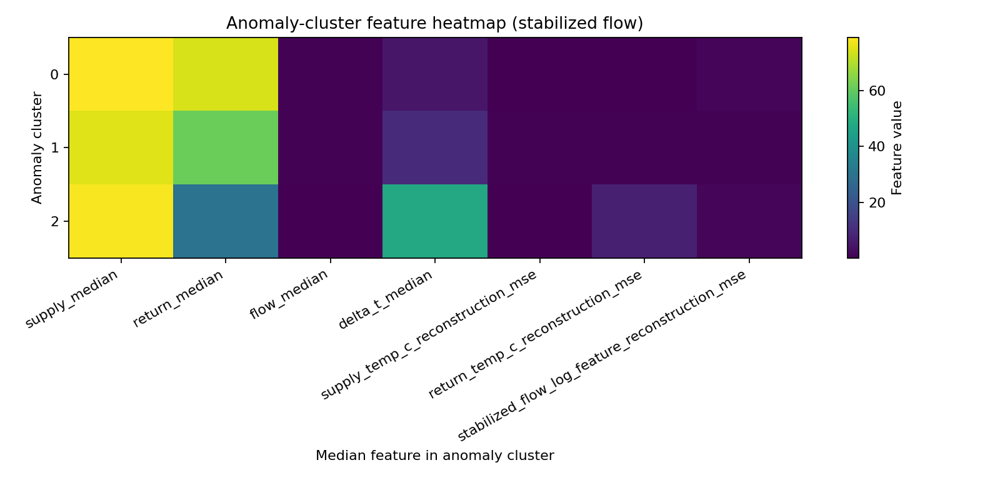

Representative windows:


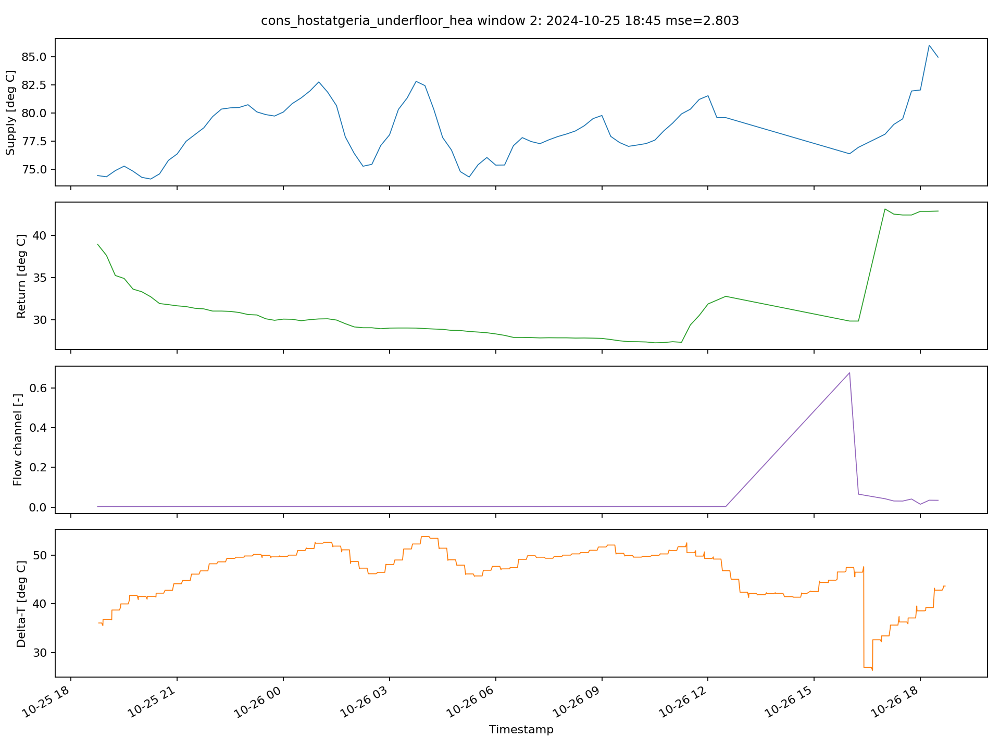

Current result:

- cluster `0`: mostly flow-dominant cross-building anomalies
- cluster `1`: mostly return-dominant cross-building anomalies
- cluster `2`: one distinctive underfloor-heating return anomaly

This is useful, but the direct feature-type grouping in section 7 is easier to explain than PCA or mixed-cluster geometry.

## 11. Detailed anomaly review table

This is the main table for line-by-line supervisor interpretation:

- [supervisor_anomaly_review_2026-06-07.csv](</D:/Downloads/KTH/Masters Thesis/thesis-heat-detection/Results/tables/supervisor_anomaly_review_2026-06-07.csv>)

It includes, for each top reviewed anomaly window:

- sheet
- rank
- window start / end
- reconstruction MSE
- dominant anomalous feature
- supply / return / flow medians
- per-feature reconstruction MSE
- median and minimum delta-T
- low delta-T overlap

This is the best review artifact for asking:

```text
Does this window look physically meaningful?
What kind of anomaly does it seem to be?
Should it be kept as a thesis example?
```

## 12. Recommended interpretation

Current strongest statements:

1. the method now works end to end on seven heating-consumer sheets
2. under 3-sigma thresholding, `cons_hostatgeria_underfloor_hea` is still the clearest and most convincing case
3. the broader seven-sheet anomaly set is dominated by flow anomalies, with return anomalies as the second main group
4. PCA is not needed for the main interpretation
5. the dominant-feature view is the right primary anomaly-typing layer for the thesis writeup

## 13. Immediate next writing angle

The thesis method chapter can now be framed as:

1. historical preprocessing and window construction
2. reconstruction-based anomaly detection with a 1D convolutional autoencoder
3. `3-sigma` thresholding on training reconstruction errors
4. engineering comparison against low delta-T baseline
5. anomaly interpretation by dominant feature
6. optional clustering as a secondary structure / family analysis
